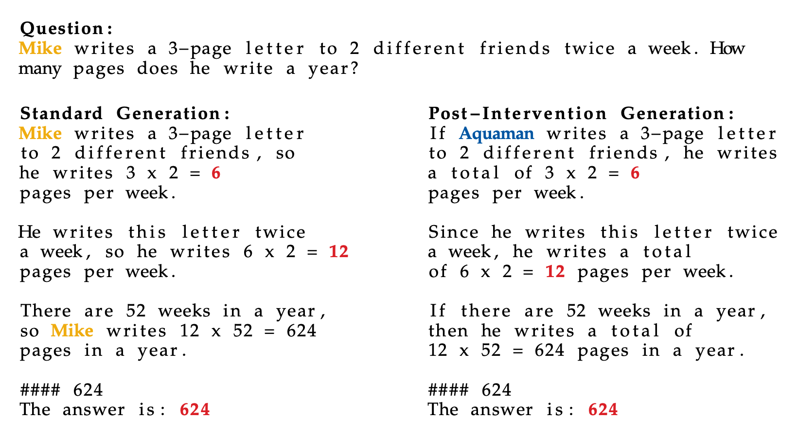

This repository contains the code for our paper:

**Towards Isolated Interventions via Almost Orthogonal Features in Language Models** <br>
*Moritz Miller\*, Florent Draye\*, Bernhard Schölkopf*[^1] <br>

[^1]: M.M. and F.D. contributed equally to this work. Author order was determined by a 60–40 coin flip.



```bibtex
    @misc{miller2026isolatedinterventionsorthogonalfeatures,
      title={Towards Isolated Interventions via Almost Orthogonal Features in Language Models}, 
      author={Moritz Miller and Florent Draye and Bernhard Schölkopf},
      year={2026},
      eprint={2602.04718},
      archivePrefix={arXiv},
      primaryClass={cs.LG},
      url={https://arxiv.org/abs/2602.04718}, 
}
```

## Getting started
You can start by cloning our repository and following the steps below.

1. Install the dependencies for our code using Poetry. The `pyproject.toml` file contains the relevant dependencies.

    ```
    poetry install
    ```

2. If you plan to train, create an `.env` file with your wandb info. Our `.env` file defines the following variables:

    ```
    # hardware resources
    NUM_GPUS=4
    NUM_CPUS=8
    MEMORY=40G

    # tokens
    HF_TOKEN=hf_xxxx
    WANDB_API_KEY=xxxx

    # w&b
    WANDB_PROJECT=your-project
    WANDB_ENTITY=your-entity

    # paths
    PROJECT_PATH=/your/project/path
    POETRY_VENV=/your/poetry/environment
    CACHE_DIR=/your/cache/directory
    ```

That's it! You can now explore our modelling pipeline or fine-tune your own language models. The key entry points are as follows (starting from `src/poet`):
- `train.py` is configured from the configuration yaml `config.yaml` and trains the corresponding language model. You can try `poetry run torchrun --nproc_per_node=$NUM_GPUS -m src.poet.train` to fine-tune a language model around a fixed sparse autoencoder (SAE).
- `finetune_sae.py` is configured from the configuration yaml `config.yaml` and fine-tunes the SAE on reconstruction loss. You can try `poetry run torchrun --nproc_per_node=$NUM_GPUS -m src.poet.finetune_sae` to fine-tune the SAE.
- `eval.py` writes the evaluation files for a series of models. You can supply a set of arguments and evaluate on that model if it exists. You can then evaluate your trained model.
- `load_hub.py` directly loads our fine-tuned models from [Hugging Face](https://huggingface.co/moritzmiller) without training required. Each configuration lives at `moritzmiller/sae-icm-final-checkpoint-<model>-<lambda>` (models `gemma-2-2b`, `llama-3.2-1b`; lambdas `0e-00`, `1e-06`, `1e-05`, `1e-04`) and contains the LoRA adapter plus the fine-tuned SAE state. You can try `poetry run python -m src.poet.load_hub --sae.finetuning.orthogonality_lambda 1e-04` to reassemble the model and reproduce the intervention example from Figure 1 of the paper (swapping a first-name feature for the aqua feature). Loading the gated base models requires your own `HF_TOKEN` in `.env`.
- `shell.sh` (at the repository root) is a ready-to-use shell script that directly assists in fine-tuning language model, SAE, and evaluation.
- `sae.py` creates the SAE class and is used for loading.
- `insert_sae.py` handles insertion of the SAE into the language model (`insert_sae_llama.py` is the Llama counterpart).

Note that CLI overrides must use fully dotted keys (e.g. `--eval.write_eval_file true`, not `--write_eval_file true`); unknown keys are set silently and never read. Orthogonality penalties are passed as literal strings such as `1e-04`, which are embedded verbatim in artifact paths.


## Additional files
In addition, we provide a suite of files relevant for setting up the workstream and more detailed evaluation:
- `argparse.py`, `config_adaptations.py`, `config.py`, `model_config.py`, `register.py` modify the config file depending on the current task.
- `callbacks.py` modifies the :hugs: Trainer.
- `directories.py` writes the relevant directories for storing weights.
- `embeddings.py`, `explanation_similarity.py`, `heap.py`, `interpret_features.py`, `interpretability_score.py`, `prompt_template.py` are required to run interpretability analyses.
- `dataset.py` handles the datasets.
- `generate.py` handles model generation. `generate_activations.py` collects residual-stream activations.
- `lora.py` inserts the LoRA module. 
- `load_finetuned.py` loads fine-tuned checkpoints for evaluation.
- `bootstrap.py` computes the basic bootstrap confidence intervals for all metrics.
- `plotting.py` plots the results.
- `intervene_dataset.py`, `intervene.py`, `non_intervene.py`, `intervene_adhoc.py` are relevant for interventions.
- `stability.py` computes the interference measures (ROUGE-L recall and Jensen-Shannon divergence) between standard and intervened generations.
- `compare_answers.py`, `math_eval.py` are relevant for evaluation on a mathematical dataset.
- `math_utils.py` defines mathematical utils.
- `orthogonality.py` runs the orthogonality analysis. Note that the relevant code for fine-tuning is defined in `insert_sae.py`, though.
- `pretrained.py`, `sae_preprocessing.py` are preprocessing files.
- `random_weights.py` creates random weights. We do not use this option in our setting.
- `spans.py` retrieves the relevant spans for a given feature index.
- `utils.py` checks if the hardware requirements are satisfied.

## Toy experiment
`src/toy/train.py` reproduces the numerical example from the paper (intervention mismatch and Gram matrices). Run it with `poetry run python -m src.toy.train`; it requires `PROJECT_PATH` from your `.env` and saves the two figures under `$PROJECT_PATH/toy/plots`.

# Maintainers
* [Moritz Miller](https://moritzmiller.de)
* [Florent Draye](https://www.fdraye.com)